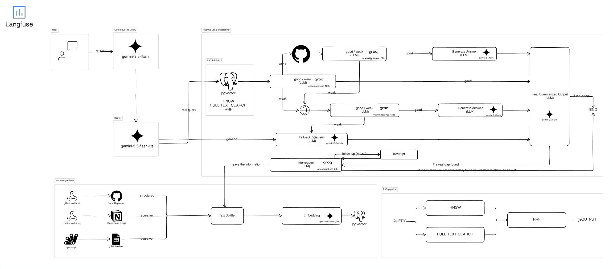

# InterviewPrep — Agentic RAG for Interview Preparation

An **agentic Retrieval-Augmented Generation (RAG)** system that answers interview-prep questions by routing, retrieving, grading, and synthesizing knowledge from a live, self-updating knowledge base (GitHub READMEs, Notion pages, Google Sheets) — with full LLM observability via Langfuse.

Built to explore production-grade **multi-agent orchestration**, **hybrid retrieval**, and **prompt engineering**, not just a wrapper around an LLM API.



---

## ✨ Key Highlights

- **Multi-agent LangGraph pipeline** — Router → Retrieval → Grading → Contextualizer → Interrogator → Answer → Summarizer, with conditional escalation
- **Escalation agents** for live augmentation when the vector store is stale/insufficient: `GitHubLiveAgent` (PyGithub) and `WebSearchAgent` (Tavily)
- **Hybrid retrieval**: dense (pgvector) + lexical, fused via Reciprocal Rank Fusion, with an LLM-based relevance grader gating what reaches generation
- **Self-updating knowledge base** via inbound webhooks (GitHub push, Notion, Google Sheets) + APScheduler for periodic sync — no manual re-indexing
- **Structured prompt engineering**: ROLE / CONTEXT / TASK / CONSTRAINTS / EXAMPLES / OUTPUT FORMAT framework per agent, with strict citation-to-reference parity and per-asset-type inclusion rules (images, tables, Mermaid diagrams)
- **Full LLM observability** with Langfuse — traces, token usage, latency, and cost per agent hop (see `README_2.0.md`)
- **Streaming chat UI** (Next.js + React 19) with live "agent thinking" status and Markdown/Mermaid/code rendering
- **Async, typed, production-shaped backend**: FastAPI, SQLAlchemy 2.0 (async), Alembic migrations, Pydantic Settings, structured JSON logging with request-id propagation
- Dockerized multi-service stack (API + pgvector + MongoDB) via `docker-compose`

---

## 🧠 Tech Stack & Keywords

**GenAI / LLM Engineering:** LLM Orchestration · Multi-Agent Systems · Agentic RAG · LangGraph · LangChain · Prompt Engineering · Prompt Versioning · Retrieval-Augmented Generation (RAG) · Hybrid Search (Dense + Lexical) · Reciprocal Rank Fusion (RRF) · Relevance Grading / Self-Correction · Query Routing · Function/Tool Calling · LLM Evaluation & Observability (Langfuse) · Structured Outputs (Pydantic) · Fallback/Retry Model Routing

**Models & APIs:** Google Gemini (`gemini-3.5-flash`), Groq (OSS 120B), Gemini Embeddings, Tavily Search API, GitHub API

**Retrieval / Data:** pgvector (PostgreSQL vector store), Vector Embeddings, Semantic Chunking, MongoDB (conversation store), Alembic (schema migrations)

**Backend:** Python 3.12, FastAPI, SQLAlchemy 2.0 (async), AsyncPG, Pydantic v2, APScheduler, Tenacity (retries), Uvicorn

**Frontend:** Next.js 16, React 19, TypeScript, Tailwind CSS, react-markdown, Mermaid diagram rendering

**DevOps / Tooling:** Docker & Docker Compose, GitHub Actions–ready structure, Pytest + Pytest-Asyncio, Ruff, uv (dependency management), Webhooks (GitHub/Notion/Sheets), Structured Logging

---

## 🏗️ Architecture

The diagram above (`assets/Archtiecture.png`) shows the end-to-end flow: a user query enters the FastAPI layer, is routed by the **Router Agent**, passed through **hybrid retrieval + grading**, optionally escalated to **live GitHub/Web search** when local knowledge is insufficient, then contextualized and answered, with the **Summarizer Agent** as the sole arbiter of which assets (images/tables/diagrams) reach the user. Every hop is traced in Langfuse.

## 📈 Observability

This project treats observability as a first-class concern, not an afterthought. Every agent invocation is traced end-to-end with **Langfuse**, capturing prompts, token usage, latency, and cost per node in the LangGraph pipeline. See [`README_2.0.md`](README_2.0.md) for a live dashboard screenshot.

## 🚀 Getting Started

```bash
# Backend
uv sync
cp .env.example .env   # fill in API keys (Gemini, Groq, Tavily, Langfuse, GitHub, Notion)
uv run alembic upgrade head
uv run api

# Frontend
cd interview-prep-frontend
npm install
npm run dev

# Or run everything with Docker
docker compose up --build
```

## 🧪 Testing

```bash
uv run pytest tests/
```

## 📁 Project Structure

```
src/interview_prep_qna/
├── core/agent/        # LangGraph nodes: router, retrieval, grading, contextualizer,
│                       # interrogator, answer, summarizer, escalation (GitHub/Web)
├── knowledge_base/     # loaders, splitter, embedder
├── conversations/      # MongoDB-backed chat history
├── webhooks/            # GitHub / Notion / Google Sheets ingestion
├── observability/      # Langfuse client, structured logging
├── db/                  # Postgres + pgvector client
└── api/                 # FastAPI routes

interview-prep-frontend/  # Next.js streaming chat UI
```

## 📄 License

See [LICENSE](LICENSE).